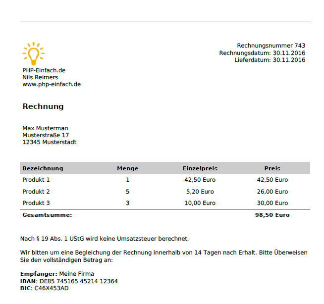

# PDF-Rechnung per PHP erstellen

[**Download Source-Code (.zip)**](https://github.com/PHP-Einfach/pdf-rechnung/archive/master.zip)

Weitere Informationen: [PDF-Rechnung per PHP erstellen](http://www.php-einfach.de/experte/php-codebeispiele/pdf-per-php-erstellen-pdf-rechnung/)

In der Datei [rechnung.php](rechnung.php) findet ihr ein Beispiel, wie ihr mittels PHP PDF-Dokumente dynamisch erzeugen könnt. Hierzu wird im PHP-Script entsprechender HTML-Code definiert, der den Inhalt des PDFs bereit hält. Dieses wird anschließend mit der Library [tcpdf](https://tcpdf.org) in ein PDF-Dokument übersetzt. Hierdurch müsst ihr keine komplizierte Befehle zur Erzeugung des PDF-Dokuments lernen: Einfacher HTML-Code ist ausreichend.

[rechnung.php](rechnung.php) enthält ein Beispiel zur Erzeugung einer dynamischen PDF-Rechnung. Diese könnt ihr entweder auf dem Server speichern, oder diese direkt im Browser an den Benutzer senden. 

Die erzeugte Rechnung sieht wie folgt aus [Beispiel_Rechnung.pdf](Beispiel_Rechnung.pdf):


## Einstelloptionen
Zu Beginn des PHP-Codes könnt ihr leicht einige Einstellungen vornehmen. Dort könnt ihr Beispielsweise die Rechnungsnummer setzen, den Absender (header) der Rechnung, den Empfänger der Rechnung, sowie natürlich die gekauften Produkte. Ebenso könnt ihr in der Variable $umsatzsteuer die Umsatzsteuer definieren. Für eine 19% Umsatzsteuer diesen Wert auf 0.19 setzen und schon wird die Umsatzsteuer entsprechend auf der Rechnung ausgewiesen. 

Möchtet ihr das Design der Rechnung anpassen oder ein komplett anderes PDF-Dokument erstellen, so schaut euch die Variable `$html`an. Die enthält den HTML-Code des PDF-Dokument. TCPDF unterstützt recht viele HTML-Befehle sowie ein paar Inline-CSS Befehle. Ihr dürft aber nicht erwarten, dass ihr dort einfach den HTML-Code eurer Website rüberkopieren könnt, und dies korrekt in eine PDF übersetzt wird.

Zum Schluss des Scripts habt ihr zwei Varianten für die Ausgabe des PDFs. Die erste Option ist, dieses direkt an den Benutzer zu senden, so dass er das PDF im Browser betrachten / herunterladen kann.
```php
//Variante 1: PDF direkt an den Benutzer senden:
$pdf->Output($pdfName, 'I');
```

Die zweite Variante ist, das PDF auf dem Server zu speichern. Hierzu ändert man den 'I'-Parameter zu 'F'. Das PDF kann dann z.B. als E-Mail versendet werden oder der Link dem Benutzer angezeigt werden:
```php
//Variante 2: PDF im Verzeichnis abspeichern:
$pdf->Output(dirname(__FILE__).'/'.$pdfName, 'F');
echo 'PDF herunterladen: <a href="'.$pdfName.'">'.$pdfName.'</a>';
```
Damit das Speichern auf dem Server funktioniert, musste ich mit `dirname(__FILE__)` den absoluten Pfad zum Abspeichern des PDF-Dokuments herausfinden. Relative Pfade scheinen nicht zu funktionieren.
